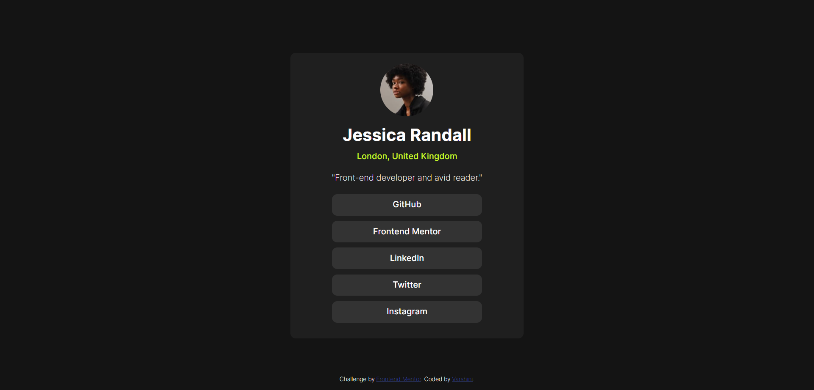

# Frontend Mentor - Social links profile solution

This is a solution to the [Social links profile challenge on Frontend Mentor](https://www.frontendmentor.io/challenges/social-links-profile-UG32l9m6dQ). Frontend Mentor challenges help you improve your coding skills by building realistic projects. 

## Table of contents

- [Overview](#overview)
- [The challenge](#the-challenge)
- [Screenshot](#screenshot)
- [My process](#my-process)
- [Built with](#built-with)
- [What I learned](#what-i-learned)
- [Continued development](#continued-development)

## Overview

This project is a simple yet elegant social links page created as a part of a Frontend Mentor challenge. The page displays various social media links using a clean and responsive design, primarily built with HTML and CSS flexboxes.

### The challenge

Users should be able to:
- Create a responsive website according to the device width
- See hover and focus states for all interactive elements on the page

### Screenshot



### Links

- Solution URL: [https://github.com/varshini-0506/frontend-mentor-social-links.git]
- Live Site URL: [Add live site URL hee]

## My process

- Planning and Design: Reviewed the challenge requirements and designs provided by Frontend Mentor.
Planned the layout and structure of the page, focusing on a responsive design.

- Development: Created the HTML structure, ensuring semantic and accessible markup.
Utilized CSS flexbox for the layout to align and distribute the social links evenly.
Ensured the design was responsive across different screen sizes and devices.


### Built with

- Semantic HTML5 markup
- CSS custom properties
- Flexbox

### What I learned

- Flexbox Layout: Gained a deeper understanding of CSS flexbox properties, including justify-content, align-items, and flex-wrap, and   how they can be used to create responsive layouts.
- Responsive Design: Improved skills in making designs responsive, ensuring the layout adapts to various screen sizes seamlessly.
- Accessibility: Learned the importance of semantic HTML and how it contributes to better accessibility and SEO.

```html
<div class="name">Jessica Randall</div>
<div class="place">London, United Kingdom</div>
<div class="bio">"Front-end developer and avid reader."</div>
```
```css
.box:hover{
      background-color: hsl(75, 94%, 57%);
      color: black;
      cursor: url(black-hand-pointing-up.png),pointer;
}
```
### Continued development

- Backend Integration: Connect the page to a backend service to dynamically generate and manage social links.
- Customization Options: Allow users to customize their social links page, choosing different themes, layouts, and icons.
- Interactivity: Add hover effects and animations to the social links for a more engaging user experience.


